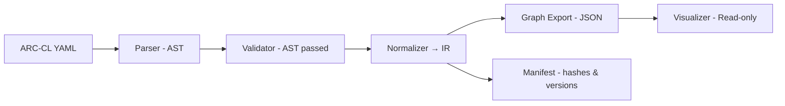

# Project ARC Docs — Phase 1 Index (Parser → IR → Graph → Visualizer)

## Scope

* Implement a deterministic front-half compiler: parse YAML, validate semantics, normalize to IR, export Graph JSON, render visualizer.
* No code generation in this phase.
* Inputs: ARC-CL YAML. Outputs: IR JSON, Graph JSON, Diagnostics.

## Deliverables

* Grammar + schema definition.
* Parser producing stable AST with source locations.
* Validator with structural, referential, and semantic checks.
* IR (Intermediate Representation) with canonical IDs and defaults.
* Graph export (nodes/ports/edges, nested scopes).
* Minimal visualizer reading Graph JSON.
* Deterministic build manifest (content hashes, inputs/outputs).
* Test fixtures and property tests.

## Pipeline (Phase 1)



## Sub-Phase Navigation

### Language & Semantics

* [Config Language Overview](./config-language)
* [Schema & Types](./schema-and-types)
* [Semantics & Constraints](./semantics)

### Front-End Compiler Stages

* [Parser](./parser)
* [Validator](./validator)
* [IR Design](./ir)
* [Graph Export](./graph-export)

### Visual System

* [Visualizer](./visualizer)
* [Graph JSON Format](./graph-json)

### Determinism, Diagnostics, Testing

* [Determinism & Hashing](./determinism)
* [Diagnostics & Error Model](./errors)
* [Testing Strategy & Fixtures](./testing)

### Project Conventions

* [Directory Layout (Phase 1)](./directory-layout)
* [Naming & IDs](./naming)

## Phase Objectives (concise)

* Parse and validate ARC-CL with precise, positional errors.
* Produce IR that is stable, minimal, and lossless for Phase 2 generators.
* Export a visual graph faithful to nested scopes and typed ports.
* Guarantee reproducible outputs from identical inputs.

## Out of Scope

* SQL/NoSQL codegen, API endpoints, SDKs, workflows on runtimes.
* Adapters beyond metadata registration.
* Live editing and round-trip writes from the visualizer.

## Core Definitions (Phase 1)

### AST (must preserve source)

* Tokens, comments, node kinds, exact spans (line, col, offset).
* No inferred defaults; store only author-provided values.

### IR (normalized, canonical)

* Entities with fully resolved field types and policies.
* Capabilities with resolved contracts and adapter bindings.
* Endpoints with method/path → capability.op binding.
* Workflows as typed graphs (steps + control nodes).
* Views as typed projections.
* Adapters as opaque configs with declared capability support.

### Graph JSON (visual)

* Scopes as groups; nodes with `kind`, `ports` (typed), edges with `mode` (`req|stream`).
* Stable IDs for diffing; layout hints optional.

## Acceptance Checks

* Same YAML + same compiler version ⇒ byte-identical IR and Graph JSON.
* Validator rejects: missing refs, type mismatches, illegal cycles, unsupported adapter features.
* Visualizer can render nested scopes, ports, and edges for all example configs.
* Manifest lists inputs, outputs, and hashes; modifying one field changes only affected outputs.

## Minimal Directory Skeleton (Phase 1)

```
/docs
  /phase-1
    index.md                 # this file
    config-language.md
    schema-and-types.md
    semantics.md
    parser.md
    validator.md
    ir.md
    graph-export.md
    graph-json.md
    visualizer.md
    determinism.md
    errors.md
    testing.md
    directory-layout.md
    naming.md
/nucleus
  /packages
    /arc-config              # schema defs, zod/json-schema
    /arc-parser              # YAML→AST with positions
    /arc-validator           # AST checks
    /arc-ir                  # AST→IR normalizer
    /arc-graph               # IR→Graph JSON
    /arc-visualizer          # static SPA (read-only)
/examples
  /hello-arc/app.arc.yaml
  /complex/app.arc.yaml
```

## Work Plan (checklist)

* Grammar finalized and versioned.
* Parser produces AST with spans for all nodes.
* Validator rules implemented with error codes and remediation hints.
* IR types and canonicalization rules implemented.
* Graph export conforms to spec and covers nested scopes.
* Visualizer renders large graphs with collapsing and tooltips.
* Deterministic hashing and manifest writing.
* Fixtures and property tests green on CI.
