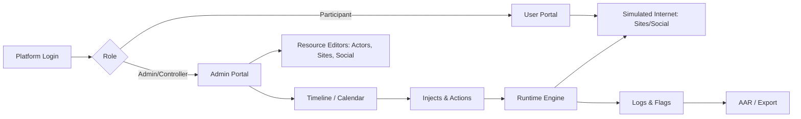
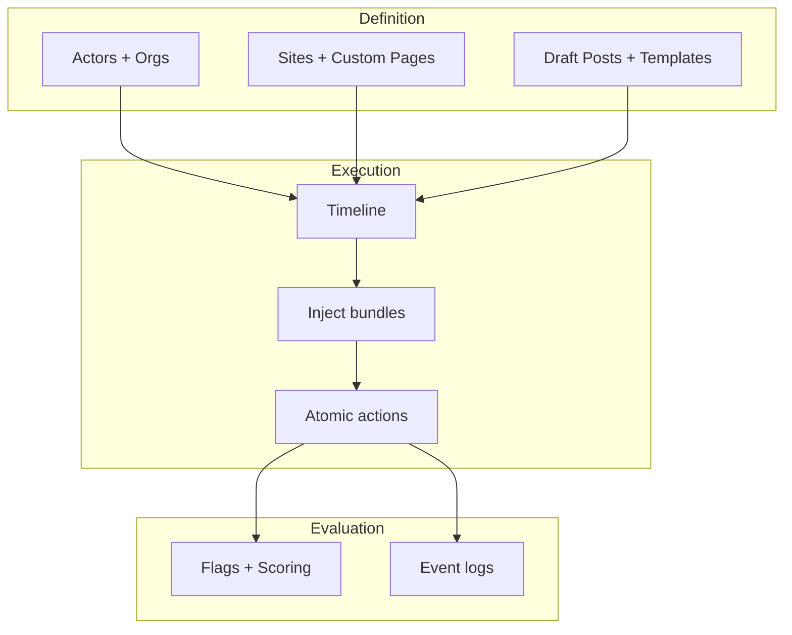
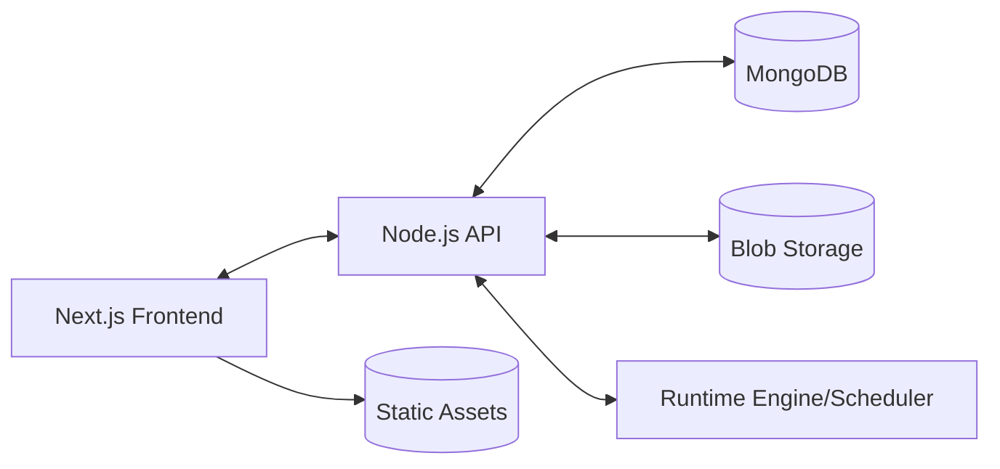
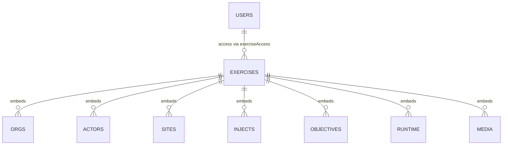
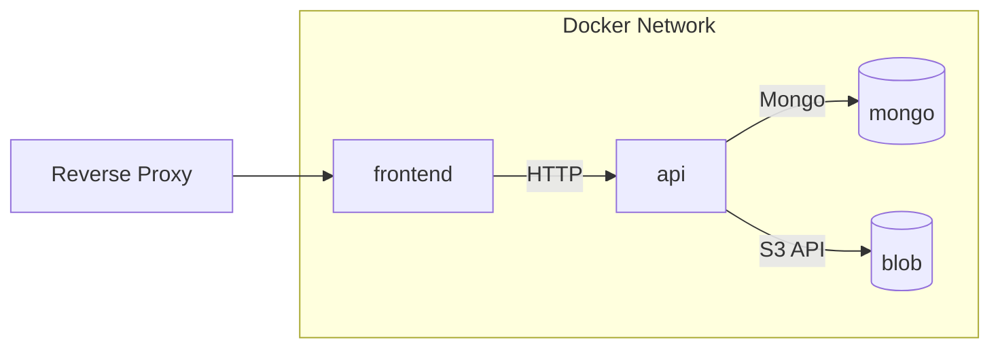

# CANION — Kickoff Document

## Mission

Create exportable, self-contained training exercises that simulate a “fake internet” end-to-end. Author once, run deterministically, review confidently. Keep the exercise as the single source of truth.

## Principles

* Exercise-centric: one document defines world, content, timeline, automation, and runtime state.
* Configuration-driven: managers edit resources; the timeline executes them.
* Deterministic and portable: export/import as JSON + blobs.
* Minimal surfaces: two Mongo collections (`users`, `exercises`). Add append-only `exercise_events` only if necessary.

## User Roles

* Platform Admin: manages platform users and any exercise.
* Exercise Admin: owns a single exercise.
* Controller: runs timeline, triggers injects.
* Participant: mapped to a PC (player character) within an exercise.
* PC: actor controlled by a participant.
* NPC: scripted/bot actor.

## High-Level Flow



## Admin Portal Structure

* Exercises list with status: Draft, Prepped, Running, Paused, Ended, Archived.
* Tools inside an exercise:

  * Social Manager (draft content, templates, curation)
  * Site Manager (clones, custom sites/pages)
  * Personnel/Actors (PCs, NPCs, orgs, graph)
  * Injects and Timeline (canonical execution surface)
  * Logs (system/player/content events)
  * Manage Exercise (lifecycle, access, export/import)

## Execution Model

* Definition layer: Actors/Orgs, Sites/Pages, Seed Content, Templates.
* Execution layer: Timeline with injects producing atomic actions.
* Evaluation layer: Flags, scoring, logs, AAR.



## Stack and Deployment

* Next.js frontend (Admin + User portals)
* Node.js API (auth, exercise CRUD, runtime engine, scheduler)
* MongoDB (users, exercises)
* Blob storage (media, long logs, exports)
* Dockerized services:

  * `frontend` (Next.js)
  * `api` (Node.js)
  * `mongo`
  * `blob` (e.g., MinIO/S3-compatible)



## Data Model Overview



## Schema Drafts (MVP, not locked; commented for options)

### `users` (global auth and per-exercise mapping)

```ts
// users collection (platform identity)
// Notes:
// - Keep platform-level auth separate from in-world actors.
// - exerciseAccess maps a platform user to role + optional PC actor per exercise.
// - Optional: add MFA, session audit, passwordless later.

{
  _id: ObjectId,
  username: string,            // unique
  passwordHash: string,        // bcrypt/argon2
  roles: ["admin" | "author" | "observer" | "participant"],

  exerciseAccess: [
    {
      exerciseId: ObjectId,
      role: "admin" | "controller" | "participant" | "observer",
      actorId: string | null      // participant→PC binding; null for observers
      // Alt design: allow multiple PCs per user if scenario demands multi-seat
    }
  ],

  status: "active" | "disabled",
  org: string | null,          // optional tenant label
  createdAt: Date,
  updatedAt: Date,
  lastLoginAt: Date
}

// Indexes:
// - { username: 1 } unique
// - { "exerciseAccess.exerciseId": 1, "exerciseAccess.role": 1 }
```

### `exercises` (single source of truth)

```ts
// exercises collection (authoring + runtime)
// Notes:
// - Authoring sections are editable pre-run; runtime is write-once per event.
// - Use blob keys for large HTML/MD/media to keep doc <16MB.
// - Deterministic IDs (string) for stable export/import.

// ---- Root ----
{
  _id: ObjectId,
  name: string,
  code: string,                      // short unique handle
  version: number,                   // bump on lock/export
  status: "draft" | "prepped" | "running" | "paused" | "ended" | "archived",
  visibility: "private" | "shareable",
  createdBy: { userId: ObjectId, username: string },
  createdAt: Date,
  updatedAt: Date,

  // ---- Access (exercise-scoped) ----
  access: {
    admins: [{ userId: ObjectId, username: string }],
    controllers: [{ userId: ObjectId, username: string }],
    participants: [{ userId: ObjectId, actorId: string | null }],
    inviteMode: "closed" | "code" | "open"
    // Option: add per-feature permissions if needed
  },

  // ---- Scenario (authoring) ----
  scenario: {
    purpose: string,                 // training intent
    synopsis: string,                // narrative summary
    tags: [string],
    rulesOfEngagement: string,       // markdown
    notes: string
    // Option: classification, visibility, legal notices
  },

  // ---- Orgs & Actors (authoring) ----
  orgs: [
    {
      id: string,                    // "org_acme"
      name: string,
      type: "Company" | "Agency" | "NGO" | "Media" | "Criminal" | "Terrorist" | "Other",
      summary: string,
      attrs: Record<string, any>     // freeform extension
    }
  ],
  actors: [
    {
      id: string,                    // "actor_jdoe"
      type: "PC" | "NPC",
      displayName: string,
      orgId: string | null,          // -> orgs.id
      profile: {
        bio: string,
        avatarKey: string | null,    // blob
        traits: [string]             // domain tags for behavior templates
      },
      accounts: [
        {
          siteId: string,            // -> sites.id
          handle: string,            // @name / username
          role: "owner" | "editor" | "member" | "none",
          visibility: "public" | "private" | "unlisted",
          credentials: { mode: "auto" | "manual" | "none", username?: string, password?: string }
          // Option: per-account bot defaults (frequency caps)
        }
      ]
    }
  ],
  graph: {
    nodes: [{ id: string, kind: "actor" | "org", ref: string }],
    edges: [
      {
        id: string,
        from: string, to: string,    // node ids
        type: "ally" | "rival" | "employs" | "influences" | "custom",
        weight: number | null,
        notes: string
      }
    ]
    // Option: typed properties (time-bounded relations)
  },

  // ---- Sites & Content (authoring) ----
  sites: [
    {
      id: string,                       // "site_google", "site_reddit_1"
      type: "Google" | "Reddit" | "Facebook" | "Instagram" | "X" | "YouTube" | "Wiki" | "News" | "Blog" | "Forum" | "Custom",
      label: string,
      enabled: boolean,
      options: Record<string, any>,     // site-specific toggles

      // Custom site builder (static or dynamic)
      pages: [
        {
          id: string,
          path: string,                 // "/topic/article-1"
          kind: "static" | "dynamic",
          contentKey: string | null,    // blob (HTML/MD) if static
          template: string | null,      // serialized component tree if dynamic
          data: any | null              // schema-less for MVP
        }
      ],

      // Seed for social/news (kept small; offload heavy sets to blob)
      seed: {
        posts: [
          {
            id: string,
            authorActorId: string | null,
            t: Date,
            text: string,
            media: [{ key: string, kind: "image" | "video" | "doc" }],
            tags: [string],
            mentions: [string],         // -> actors.id
            links: [string],
            reactions: [{ byActorId: string, type: string }],
            comments: [
              { id: string, byActorId: string, t: Date, text: string, reactions: [{ byActorId: string, type: string }] }
            ],
            visibility: "public" | "followers" | "private",
            pinned: boolean
          }
        ],
        channels: [{ id: string, ownerActorId: string, title: string, description: string }],
        searchHints: [{ query: string, results: [{ type: "post" | "page", siteId?: string, refId: string }] }]
        // Option: relevance scoring knobs for search
      }
    }
  ],

  // ---- Timeline & Injects (execution plan) ----
  timeline: {
    phases: [
      { id: string, name: string, startMin: number, endMin: number, notes: string }
    ]
    // Absolute schedule derived at start; offsets enable replay
  },
  injects: [
    {
      id: string,
      name: string,
      description: string,
      trigger: {
        mode: "time" | "manual" | "conditional",
        atMin?: number,                              // minutes from T0
        condition?: { type: string, expr: any }      // mini rule engine for MVP
      },
      actions: [
        {
          id: string,
          type:
            | "PublishPage"
            | "CreatePost"
            | "Comment"
            | "DM"
            | "SearchBoost"
            | "ActivateBot"
            | "DeactivateBot"
            | "PhaseChange"
            | "Banner"
            | "Custom",
          siteId?: string,
          actorId?: string,
          payload?: any
          // Design rule: actions are atomic; chain multiple actions per inject
        }
      ],
      owner: { userId: ObjectId, username: string },
      tags: [string]
    }
  ],

  // ---- Objectives & Flags (evaluation) ----
  objectives: [
    {
      id: string,
      title: string,
      description: string,
      weight: number,                                 // 0..1
      flags: [
        {
          id: string,
          code: string,                               // unique within exercise
          description: string,
          detection: {
            type: "event" | "pathContains" | "manual",
            event?: { kind: string, actorId?: string, siteId?: string, contains?: string }
          }
        }
      ]
    }
  ],
  scoring: { mode: "sum" | "rubric", thresholds: { pass: number, merit: number } | null },

  // ---- Automation hooks (bounded) ----
  automation: {
    aiEnabled: boolean,
    provider: "openai" | "bedrock" | "vertex" | "none",
    apiKeyRef: string | null,                          // key vault reference
    scripts: [
      {
        id: string,
        name: string,
        when: { onInjectId?: string, offsetMin?: number },
        do: { type: "GeneratePost" | "Rewrite" | "Summarize" | "Custom", siteId?: string, args?: any },
        guardrails: { maxTokens: number, temperature: number }
        // Option: per-actor style prompts; keep deterministic defaults
      }
    ]
  },

  // ---- Runtime (separate from authoring) ----
  runtime: {
    lockedAt: Date | null,
    startedAt: Date | null,
    pausedAt: Date | null,
    endedAt: Date | null,
    clockMin: number,                                   // accumulated minutes
    phaseId: string | null,
    executedInjects: [{ injectId: string, at: Date, outcome: "ok" | "error", note?: string }],

    // Compact ring buffer for control room; roll-ups to blob beyond N events
    eventsCompact: [
      { t: Date, kind: string, actorId: string | null, siteId: string | null, refId: string | null, meta: any }
    ],
    eventBlobKeys: [string]
  },

  // ---- Media / Exports / Audit ----
  media: [{ key: string, kind: "image" | "video" | "doc", label: string, tags: [string] }],
  exports: [{ version: number, at: Date, key: string, size: number, sha256: string }],
  audit: [{ at: Date, byUserId: ObjectId, byUsername: string, change: string }]
}

// Indexes:
// - { status: 1, updatedAt: -1 }
// - { code: 1 } unique
// - { "sites.type": 1, "sites.enabled": 1 }
// - { "actors.id": 1 } sparse
// - { "injects.trigger.mode": 1 }
// - { "objectives.flags.code": 1 } sparse
```

### Optional `exercise_events` (add only if needed)

```ts
// High-volume append-only events for analytics/AAR at scale.
// Keep authoring/runtime control in `exercises`.
{
  _id: ObjectId,
  exerciseId: ObjectId,
  t: Date,
  kind: string,                  // "post.created", "search.query", "inject.executed", ...
  actorId: string | null,
  siteId: string | null,
  refId: string | null,
  meta: any
}
// Indexes:
// - { exerciseId: 1, t: 1 }
// - { exerciseId: 1, kind: 1, t: -1 }
```

## API Surface (indicative)

* `POST /api/login`
* `GET/POST/PATCH /api/exercises`
* `GET/PATCH /api/exercises/:id` (ETag + subpath patching)
* `POST /api/exercises/:id/lock` → status: prepped
* `POST /api/run/:id/start|pause|end`
* `POST /api/run/:id/injects/:injectId/trigger`
* `GET /api/run/:id/events?since=...` (SSE)
* `POST /api/exercises/:id/export` → bundle key
* `POST /api/exercises/import` → creates new exercise

## Validation Gates

* Reference integrity: `actorId`, `orgId`, `siteId`, `injectId`.
* Seed/content size checks → offload to blob.
* Inject action/site compatibility.
* Objectives/flags resolvable against event shapes.
* Locking prevents authoring mutations during run.

## Security and Isolation

* All in-world identities scoped to a single exercise.
* Export bundles with hash, optional media redaction.
* RBAC via `users.roles` and `exercises.access`.
* No cross-exercise reads for participants.

## MVP Feature Set

* Platform auth; exercises CRUD; access control.
* Actors/Orgs graph; Sites (Google + two socials); Custom pages builder.
* Seed content; templates; timeline with atomic actions.
* Manual triggers; compact logs; flags; basic scoring.
* User portal “browser” with search and shortcuts.
* Export/import bundle.

## Containers and Boot

* `frontend`: Next.js app, served behind reverse proxy.
* `api`: Node.js, runs scheduler, SSE, and Mongo/Blob clients.
* `mongo`: persistent volume for `users`, `exercises`.
* `blob`: S3-compatible, bucket per environment.
* Shared network; secrets via env or vault; health checks for API and DB.



## Development Notes

* Deterministic string IDs for export stability.
* Patch-style updates to subtrees to minimize concurrent edit conflicts.
* Ring buffer for `runtime.eventsCompact` (e.g., 10k events), periodic roll-ups to blob.
* Seed content and templates authored in Admin; timeline remains canonical for execution.
