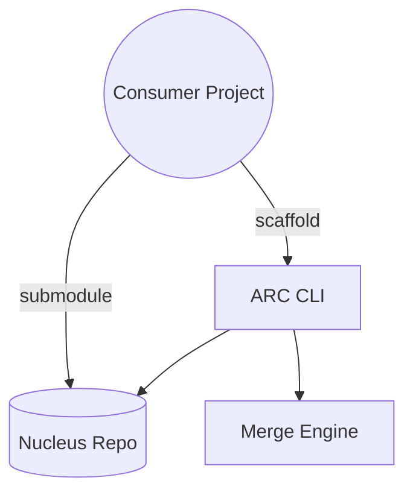

PROCEED

# The Nucleus: Component Library and ARC CLI Integration

## Executive Summary

* Problem: teams need a proprietary component system usable both as local source (shadcn-style) and as Git-linked module.
* Outcome: a dual-mode system, **The Nucleus**, with a companion CLI (**ARC CLI**) for scaffolding, syncing, and merging updates.
* Scope: component library design, submodule and scaffolding workflows, update/merge automation.
* Audience: senior engineers designing and maintaining the library.
* Strategy: maintain a single canonical repo, enable two consumption modes, and build a CLI to unify interaction.

## Context

* Current state: components are scattered, no consistent sharing or update path.
* Constraint: library must remain private/proprietary, not published to npm.
* Users: engineers consuming components in different projects across GitLab/GitHub.
* Workflows:

  * Pull specific components locally (like shadcn).
  * Consume full repo as Git submodule.
* Non-goals: public npm distribution, full-blown package registry.

## Objectives and Success Criteria

* Provide a single canonical repo for all components.
* Enable consumption as:

  1. Submodule in larger repo.
  2. Scaffolding system (copy files into project).
* Provide CLI (`arc`) for install, update, and merge workflows.
* Ensure updates can merge with local modifications.
* Success = components reused across projects without duplication, updates manageable via CLI.

## System Overview

**Architecture summary:**

* Core repo: **The Nucleus** (components + manifest).
* CLI: **ARC CLI**, interfaces with Git operations and scaffolding logic.
* Consumption: submodule or scaffold.
* Update mechanism: Git-native merges (submodule) or CLI three-way merges (scaffold).



**Key risks and mitigations**

| Risk                                | Mitigation                                  |
| ----------------------------------- | ------------------------------------------- |
| Merge conflicts in scaffold updates | CLI three-way merge, conflict markers       |
| Submodule update friction           | Wrapper in CLI for `git submodule update`   |
| Private repo access issues          | Enforce token/SSH auth in CLI               |
| Divergence between modes            | Single canonical repo + manifest-driven CLI |

## Core Concepts

* **The Nucleus**: central component repo, canonical source of truth.
* **ARC CLI**: tool for fetching, updating, merging, and managing components.
* **Scaffold mode**: shadcn-style copy of components into consumer project.
* **Submodule mode**: embed Nucleus as Git submodule.
* **Manifest**: JSON index mapping component names to file paths and metadata.

## Data Model (Essential)

```ts
type CommitHash = string;

type ComponentMeta = {
  name: string;
  files: string[];
  deps?: string[];
};

type Manifest = Record<string, ComponentMeta>;

type InstalledComponent = {
  name: string;
  localPath: string;
  installedFrom: CommitHash;
};

type ProjectState = {
  installed: InstalledComponent[];
  config: { autoUpdate: boolean };
};
```

## State, Events, and Collaboration

```ts
type Command =
  | { type:'INSTALL'; component:string }
  | { type:'UPDATE'; component:string }
  | { type:'CHECK_UPDATES' }
  | { type:'CONFIG_SET'; key:string; value:any };

function reduce(state: ProjectState, cmd: Command): ProjectState;
```

* Collaboration: Git-backed for submodules; manifest + commit hashes for scaffold mode.

## Algorithms and Indices

* **Update detection (scaffold mode)**:

  1. Read local component commit.
  2. Compare with upstream manifest commit.
  3. If mismatch → mark as update.
* **Three-way merge (scaffold mode)**:

  * Base: commit at install.
  * Local: current file.
  * Remote: latest upstream.
  * Run `git merge-file` or diff3 to produce merged output.
* **Submodule update**: wrapper around `git submodule update --remote`.

## Compute Placement

| Compute                 | Placement    | Rationale                |
| ----------------------- | ------------ | ------------------------ |
| File fetch, diff, merge | Client (CLI) | Needs local file context |
| Submodule management    | Git client   | Git-native               |
| Manifest resolution     | Client (CLI) | Lightweight JSON         |
| Authentication          | Git server   | Enforced at repo level   |

## API Surface

* CLI commands:

  * `arc add <component>` → scaffold from Nucleus.
  * `arc update <component>` → merge upstream changes.
  * `arc check` → list outdated components.
  * `arc submodule add` → install repo as submodule.
  * `arc submodule update` → sync submodule.
  * `arc config` → toggle auto-update.

## Rendering Model

Not relevant — no UI runtime rendering beyond developer code imports.

## Persistence and Storage

* **Canonical storage**: GitLab/GitHub repo.
* **Local project state**: `.arc/state.json` in consumer repo to track installed components and commit hashes.
* **No database**; Git provides versioning.

## Error/Recovery

* **Conflicts**: Insert conflict markers, require developer resolution.
* **Auth errors**: CLI fails early if token/SSH missing.
* **Broken manifest**: CLI validates schema before applying.

## Testing

* Unit tests for CLI commands.
* Golden tests for manifest parsing.
* Fixture-based tests for three-way merge (local vs remote).
* Integration tests: simulate consumer project with scaffold + update.

## Milestone Breakdown

1. **Week 1-2**: Establish Nucleus repo, add manifest schema.
2. **Week 3-4**: Build ARC CLI skeleton (`add`, `update`, `check`).
3. **Week 5-6**: Implement submodule wrapper commands.
4. **Week 7-8**: Implement three-way merge + conflict handling.
5. **Week 9-10**: Add config system + auto-update mode.
6. **Week 11**: Testing, fixtures, docs.
7. **Week 12**: Rollout to first consumer projects.

## Justifications

* Single repo avoids divergence.
* CLI needed to unify both scaffold and submodule workflows.
* Three-way merge essential to preserve developer edits.
* Submodules supported because some projects prefer full repo linkage.

## Assumptions and Decisions

* Assumed greenfield (no legacy component library).
* Assumed private GitLab as canonical host; GitHub consumption supported.
* Decided: no npm package registry; no node\_modules distribution.
* Decided: updates will always attempt merge before overwrite.
* Assumed CLI is Node.js-based, distributed via `npx`.

## Open Space (Thinking Room)

* Future: component templating (theme tokens, design variants).
* Possible integration with design system documentation site.
* Later: prebuilt diff viewer for merges, to reduce conflict pain.
* Potential extension: workspace support (monorepo projects pulling components directly).
