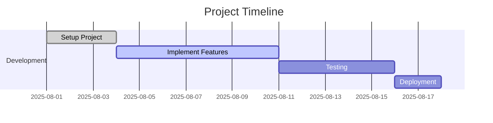

# Mermaid Diagram Test

This is a test page for Mermaid diagrams inside `.md`/`.mdx` files.

## Flowchart Example

```mermaid
flowchart TD
    A[Start] --> B{Is it working?}
    B -- Yes --> C[Celebrate!]
    B -- No --> D[Debug]
    D --> B
````

## Sequence Diagram Example

```mermaid
sequenceDiagram
    participant User
    participant App
    participant Server

    User->>App: Open Mermaid page
    App->>Server: Fetch data
    Server-->>App: Respond with data
    App-->>User: Render diagram
```

## Gantt Chart Example

