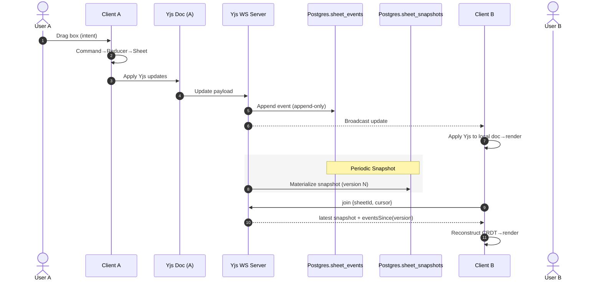
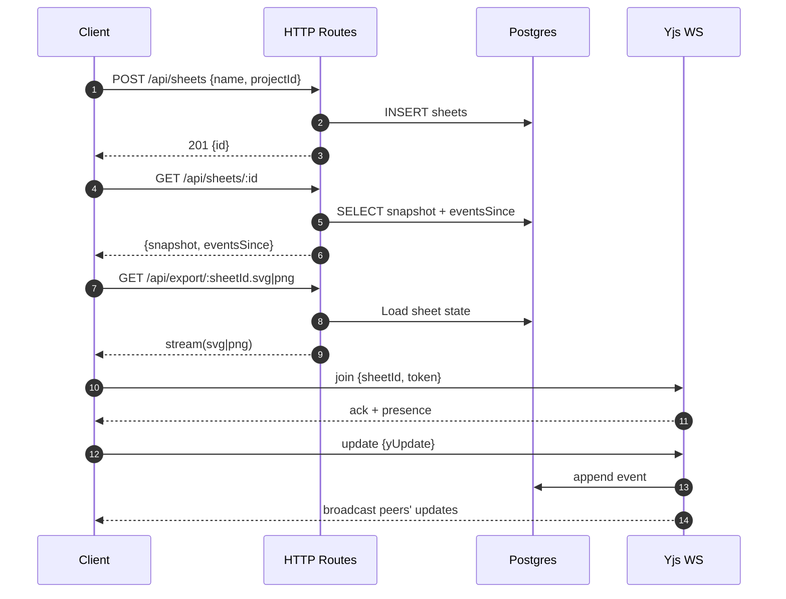
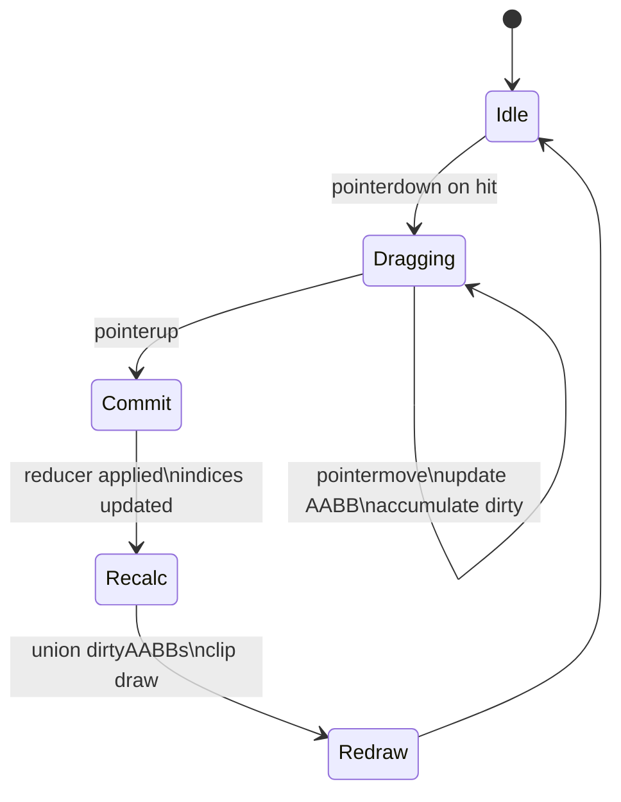
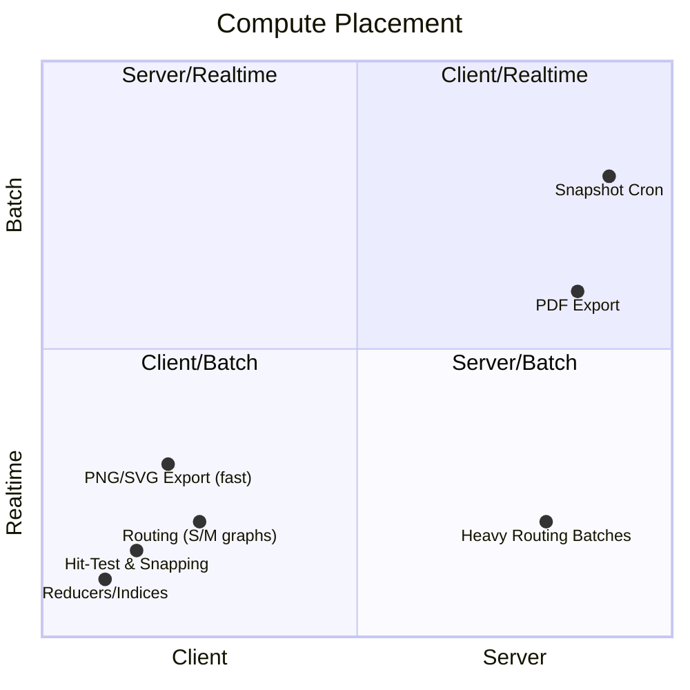
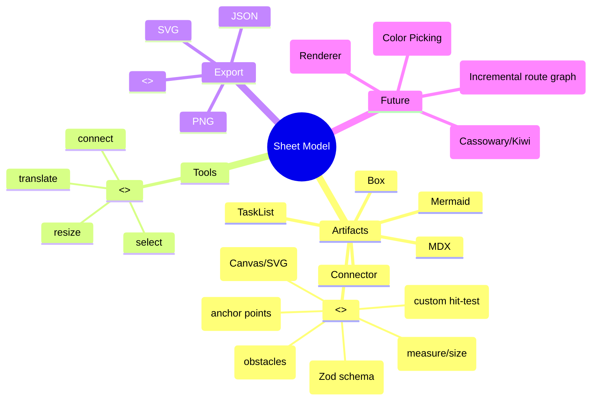
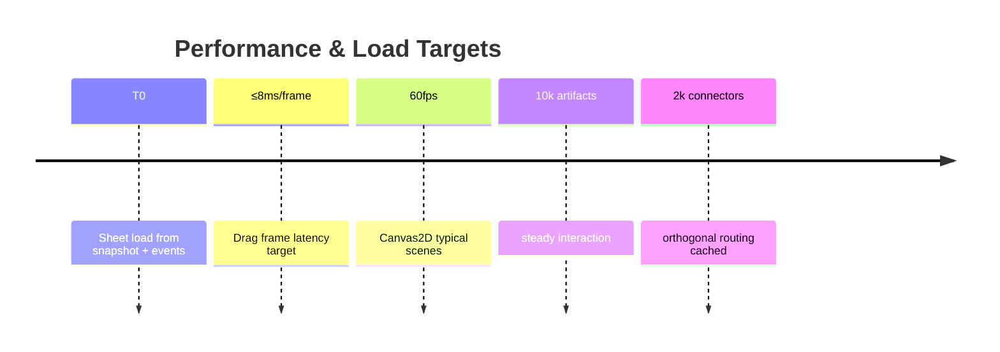
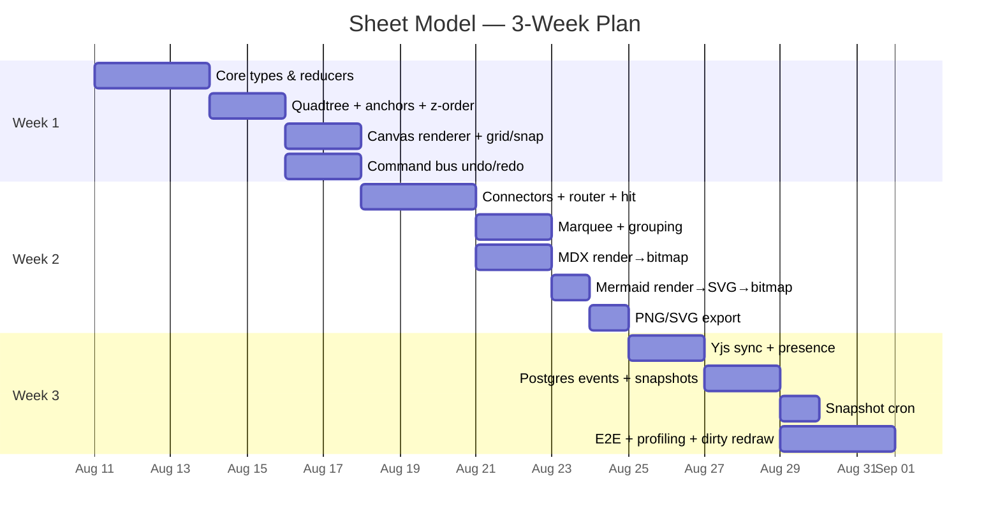
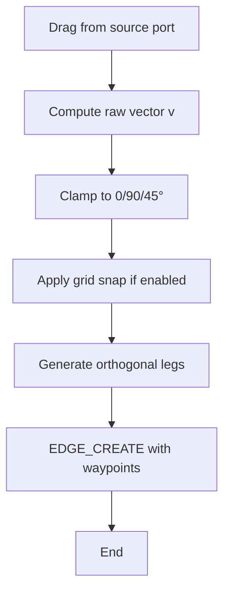
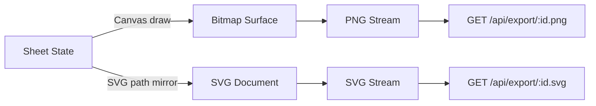

### System Context & Data Flow

```mermaid
graph TB
  %% Client
  subgraph C[Client (Next.js app route, client component)]
    Input[Pointer/Keyboard Input]
    Gizmo[Interaction Gizmos]
    CmdBus[Command Bus\n(undo/redo stack)]
    Reducer[Pure Reducers]
    Sheet[Sheet Model\n(artifacts, edges, order, config)]
    Derived[Derived Indices\nQuadtree / Anchors / Z-Order / Selection]
    Renderer[Canvas2D Renderer\n(dirty regions)]
    Exporter[Export Engine\nPNG/SVG/JSON]
    YDoc[Yjs Document]
  end

  %% Server
  subgraph S[Node WebSocket + HTTP API]
    YSrv[Yjs WS Server]
    API[HTTP Route Handlers]
    Cron[Snapshot Cron]
  end

  %% Storage
  subgraph DB[(PostgreSQL)]
    Projects[(projects)]
    Sheets[(sheets)]
    Events[(sheet_events)]
    Snaps[(sheet_snapshots)]
  end

  Input --> Gizmo -->|Intents| CmdBus -->|Commands| Reducer -->|immutable-ish update| Sheet
  Sheet --> Derived --> Renderer -->|Dirty AABBs| Renderer
  Sheet --> Exporter
  Sheet <-->|apply| YDoc
  YDoc <-->|updates| YSrv
  API <-->|HTTP| C
  YSrv -->|append CRDT deltas| Events
  Cron -->|materialize latest| Snaps
  API -->|GET /api/sheets/:id| Snaps
  API -->|eventsSince| Events
  Projects -. rel .- Sheets
  Sheets -. fk .-> Events
  Sheets -. fk .-> Snaps
```

### Command → Render Pipeline

```mermaid
flowchart LR
  A[Pointer Down/Move/Up] --> B[Hit-Test\nquadtree.queryPoint/queryAABB]
  B --> C[Topmost by Z-Order]
  C --> D[Gizmo\ntranslate/resize/connect]
  D --> E[Snap\n(grid|anchors|angles)]
  E --> F[Command\nART_PATCH/CREATE/EDGE_CREATE/...]
  F --> G[Reducer\npure updates on Sheet]
  G --> H[Derived Indices\nincremental update]
  H --> I[Dirty Region Union\nminimal redraw]
  I --> J[Canvas2D Draw\ngrid→edges→artifacts→handles→cursors]
  G --> K[CRDT Mapping\nYjs ops]
  K --> L[Broadcast via WS]
```

### CRDT Sync & Persistence (Sequence)



### Database ERD

```mermaid
erDiagram
  PROJECTS ||--o{ SHEETS : contains
  SHEETS ||--o{ SHEET_EVENTS : logs
  SHEETS ||--|| SHEET_SNAPSHOTS : has_latest

  PROJECTS {
    uuid id PK
    text name
    uuid owner_id
    timestamptz created_at
  }

  SHEETS {
    uuid id PK
    uuid project_id FK
    text name
    jsonb config
    timestamptz created_at
  }

  SHEET_EVENTS {
    bigint id PK
    uuid sheet_id FK
    uuid actor_id
    timestamptz ts
    jsonb payload
  }

  SHEET_SNAPSHOTS {
    uuid sheet_id PK FK
    bigint version
    jsonb state
    timestamptz updated_at
  }
```

### Core Types (Class Diagram Approximation)

```mermaid
classDiagram
  class Vec2 { +number x +number y }
  class AABB { +number x +number y +number w +number h }
  class Style { +string fill +string stroke +number strokeWidth +number radius }
  class Artifact {
    <<interface>>
    +Id id
    +string type
    +AABB geom
    +Style style
  }
  class BoxArtifact { +props: {label?} }
  class MDXArtifact { +props: {source} }
  class MermaidArtifact { +props: {source} }
  class TaskListArtifact { +props: {items[]} }

  class EdgeEnd { +Id id +string port }
  class Edge { +Id id +EdgeEnd from +EdgeEnd to +string type +labels[] }

  class Derived {
    +QuadtreeIndex spatial
    +AnchorIndex anchors
    +Set~Id~ selection
    +AABB[] dirtyAABBs
  }

  class Sheet {
    +Id id
    +string name
    +config:{grid:number,snap:boolean,theme}
    +artifacts: Record~Id,Artifact~
    +edges: Record~Id,Edge~
    +order: Id[]
    +_derived: Derived
  }

  Artifact <|-- BoxArtifact
  Artifact <|-- MDXArtifact
  Artifact <|-- MermaidArtifact
  Artifact <|-- TaskListArtifact
  Sheet "1" o-- "many" Artifact
  Sheet "1" o-- "many" Edge
  Sheet "1" o-- Derived
```

### Derived Indices & Ops

```mermaid
flowchart TB
  subgraph D[Derived Indices]
    Q[QuadtreeIndex\ninsert/remove/query]
    A[AnchorIndex\nprecomputed centers/mids/corners]
    Z[Z-Order Array\nId[] + index map]
    S[Selection Set]
  end
  E[Events: ART_CREATE/ART_PATCH/ART_DELETE/EDGE_*] -->|delta AABB| Q
  E -->|recompute anchors(id)| A
  E -->|mutate order| Z
  E -->|SELECT_*| S
  Q -->|queryPoint/queryAABB| Hit[Hit-Testing]
  A -->|nearest anchors| Snap[Snapping]
  Z -->|sort candidates| Hit
```

### Orthogonal Router & Caching

```mermaid
flowchart LR
  Start[Endpoints + Obstacle Set] --> Inflate[Inflate Obstacles by margin]
  Inflate --> Gridize[Grid Overlay (cell = k px)]
  Gridize --> AStar[A* Search\nManhattan metric]
  AStar --> Path[Raw Waypoints]
  Path --> Simplify[Remove Collinear Bends]
  Simplify --> Route[Final Orthogonal Polyline]
  Start ---> CacheKey[(fromGeom,toGeom,obstacleVersion)]
  CacheKey -->|hit| Route
  CacheKey -->|miss| AStar
  subgraph Nearby Changes
    Move[Endpoint Move] -->|mark| Invalid[Invalidate Cache]
    ObstacleDelta[Obstacle Change via quadtree window] --> Invalid
  end
```

### API Surface (HTTP + WS)



### Rendering State & Dirty Regions



### Compute Placement Quadrant



### Extensibility Mindmap



### Performance Targets Timeline



### Three-Week Gantt



### Connector Creation Angle Snap



### Export Paths


